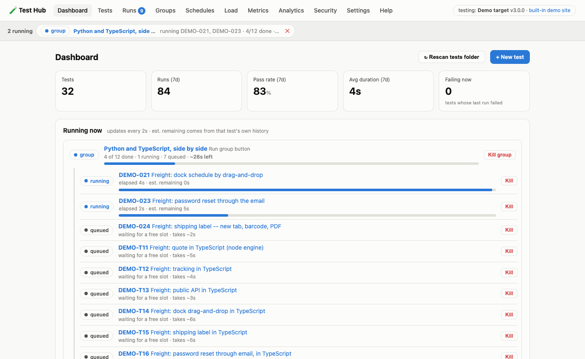
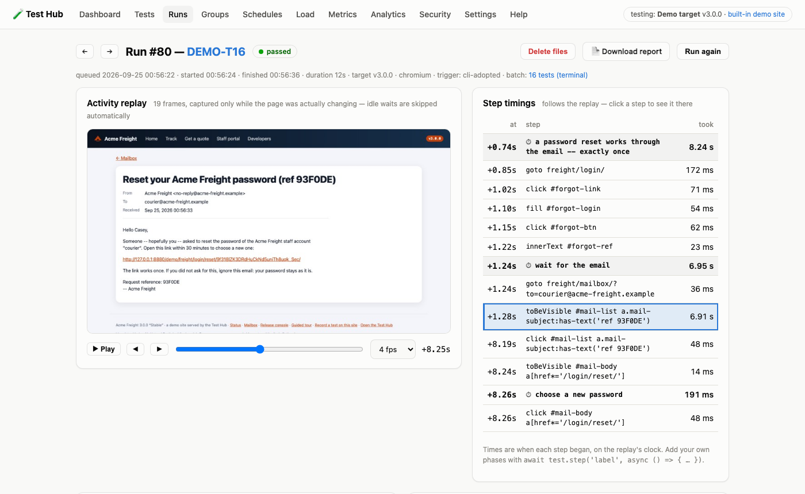
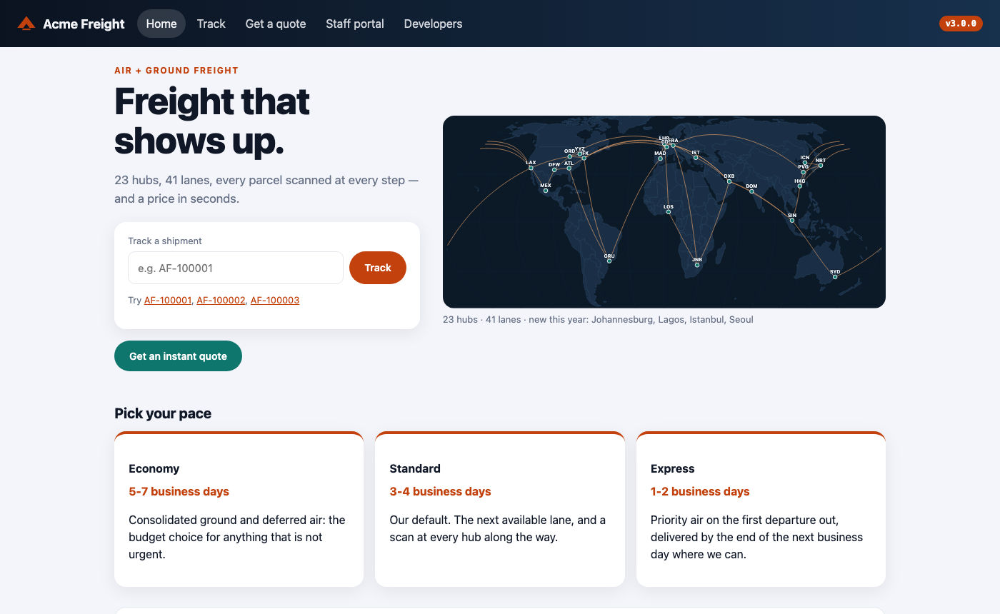
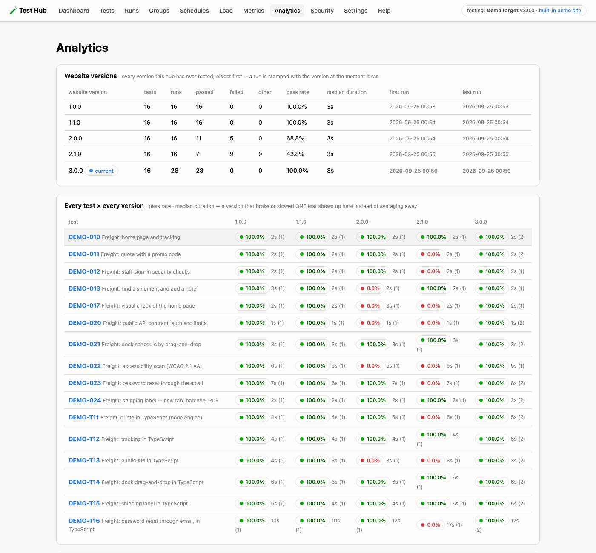

# Test Hub

**Write, run, schedule and analyse Playwright browser tests — in Python and
TypeScript — from one web page, on your own machine.**

It comes with **Acme Freight**, a realistic demo website with five releases
(and a few planted bugs in each), so every feature can be tried in minutes
before the hub is pointed at a real application.



- **Nothing leaves your machine.** No cloud service, no accounts, no calls
  out: the hub was built for air-gapped networks and runs the same way on a
  laptop.
- **One process.** The web interface, the test runner, the scheduler and the
  demo site are a single program: `./testhub.sh start`, `./testhub.sh stop`.
- **Ordinary Playwright tests.** A test is a normal Python or TypeScript
  Playwright script in a folder. There is no proprietary format and no lock-in.

---

- [Quick start](#quick-start)
- [What it does](#what-it-does)
- [Starting and stopping](#starting-and-stopping)
- [The demo site: Acme Freight](#the-demo-site-acme-freight)
- [Pointing it at your real application](#pointing-it-at-your-real-application)
- [Writing tests](#writing-tests)
- [Requirements](#requirements)
- [Where things live](#where-things-live)
- [Troubleshooting](#troubleshooting)
- [More documentation](#more-documentation)

---

## Quick start

You need macOS or Linux (on Windows, use WSL2), **Python 3.9–3.12**, and
**Node.js 20+** for the TypeScript tests. See [Requirements](#requirements)
for the details.

```bash
git clone https://github.com/pjardin/test-hub.git
cd test-hub
./testhub.sh setup      # one time, a few minutes: Python packages + browsers
./testhub.sh start
```

Open **http://127.0.0.1:8880/** and try this, which takes about two minutes:

1. **Groups → Freight smoke → Run group.** Four tests drive the demo site;
   watch them on the Dashboard.
2. **Open a finished run.** The *activity replay* shows what the browser
   saw, and the *step timings* follow it. Click a step to jump to that moment.
3. **Break the website.** Open the demo's
   [Release console](http://127.0.0.1:8880/demo/freight/releases/), deploy
   **2.1.0**, and run the group again. The promo-code and sign-in security
   tests now fail, each with a plain-English reason.
4. **Analytics** shows every test against every release it was run on.

`./testhub.sh stop` stops everything.

## What it does

| | |
|---|---|
| **Run** | one test, a selection, or a *group*; on a weekly *schedule*; from the page or the terminal. Up to 2 tests at a time (configurable), and anything can be killed. |
| **Watch** | a live view while a test runs; afterwards an **activity replay** (a screenshot only when the page changes, so a 30-minute wait costs a few MB), step timings in sync with it, the log, screenshots, the Playwright trace, a plain-English failure summary and a downloadable report. |
| **Understand** | pass rates, durations and per-step trend charts; flaky-test detection (*Metrics*); and **Analytics by website version**: every run is stamped with the version of the site it tested, so you see which release broke or slowed which test (copyable as CSV). |
| **Create** | write tests in the built-in editor or your own editor, or **record** them: the *Remote Recorder* streams a browser into the page and turns your clicks into Python or TypeScript code. |
| **Go further** | **load testing** (a real browser test repeated by N virtual users, showing which *step* slows down), **passive security observation** on every Python run (headers, cookies, calls to other hosts; it never attacks), accessibility (WCAG 2.1 AA) scanning, a credentials store, backups, and export/import of tests as a zip. |



## Starting and stopping

The demo website is served **by the Test Hub itself** (at `/demo/freight/`),
so starting the hub starts the demo site and stopping it stops both.

| command | what it does |
|---|---|
| `./testhub.sh setup` | one time: a Python environment in `.venv/`, the packages from `requirements.txt`, Chromium, and (if Node.js is installed) the TypeScript engine. Safe to re-run. |
| `./testhub.sh start` | starts the hub in the background and prints its address (default **http://127.0.0.1:8880/**). |
| `./testhub.sh start --foreground` | the same, in this terminal; **Ctrl+C** stops it. |
| `./testhub.sh stop` | stops it. A test that is still running is stopped cleanly and recorded as *killed*. If it hasn't finished stopping after 90 s, use `./testhub.sh stop --force`. |
| `./testhub.sh restart` | stop, then start (needed after editing `config.json`). |
| `./testhub.sh status` | running or not, where, what it is testing. |
| `./testhub.sh logs [-f]` | the server log (`-f` follows it). |
| `./testhub.sh run DEMO-010 DEMO-T12` | queue tests from the terminal; the running hub executes them. |
| `./testhub.sh demo-release 2.1.0` | deploy a release of the demo site (without arguments: list them). |
| `./testhub.sh typecheck` | type-check your TypeScript tests (strict), without running them. |
| `./testhub.sh unit-tests` | the hub's own test suite. |
| `./testhub.sh manage <command>` | every other hub command: `doctor`, `backup`, `samples`, `export_tests`, `history DEMO-010`, … |

**Another port, or the network.** Create `config.json` next to this README
(settings you leave out keep their defaults), then run `./testhub.sh restart`:

```json
{ "site": { "port": 8881 } }
```

`"host": "0.0.0.0"` makes the hub reachable from other machines. It has **no
login by default**, and anyone who can open it can run tests. If you open it
up, add a shared password: `"site": { "host": "0.0.0.0", "password": "…" }`.

## The demo site: Acme Freight

**http://127.0.0.1:8880/demo/freight/** is a freight company's website,
built as a test target. It has:
- a public side: shipment tracking on a map, and quotes with promo codes;
- a staff portal (sign in as `tester` / `demo-password`) with shipments,
  a route optimizer, manifest import, monthly reports, drag-and-drop dock
  scheduling and a live fleet map;
- a public REST API (its keys are on the *Developers* page), a mailbox that
  catches password-reset emails, and a status page.



It ships in **five releases**. Deploy one in the **Release console** (the
version badge at the top right of every page opens it) or with
`./testhub.sh demo-release <version>`. Every test run is stamped with the
release it ran against.

| release | what changed | what the tests notice |
|---|---|---|
| **1.0.0** "Launch" | the baseline | everything passes (a fresh hub starts here) |
| **1.1.0** "Faster search" | a new database index | the same tests, faster: Analytics' speed table |
| **2.0.0** "The redesign" | new look, new hubs | the visual check fails, the route optimizer is 2× slower, saving a note fails every third time (flaky), the API renamed a field (contract test fails), accessibility regressions |
| **2.1.0** "Hotfix" | fixes 2.0, adds "usage analytics" | promo code applied twice, session fixation at sign-in, security headers gone, a third-party tracker (Security page: HIGH), no API rate limit, reset links that work twice |
| **3.0.0** "Stable" | everything fixed, fastest yet | all green again |

The same console has an **incident simulator**: *take the site down* (HTTP
503) or *make it slow*, then *all clear*.

**32 sample tests, in 7 groups**, come with it. They are copied into your
tests folder on the first start:
- **DEMO-001…009** use the classic one-page demo at `/demo/` (forms, waits,
  a visual comparison, a long job, a shared page-object library).
- **DEMO-010…024** test Acme Freight in Python: tracking, quotes, sign-in
  security, the slow jobs, the visual check, a load subject, the live map,
  the API, drag-and-drop, accessibility, password reset by email, and
  shipping labels (with a barcode decoder).
- **DEMO-T10…T16** are in TypeScript. DEMO-T11…T16 run the same checks as
  their Python twins and reach the same verdict on every release. The group
  *Python and TypeScript, side by side* runs all twelve twins.
- **DEMO-100** is a slow test for trying the *Kill* button.

> **The visual check (DEMO-017)** compares the home page against a saved
> picture. After the 2.0 redesign it fails, as it should. To approve the new
> look, delete `data/tests/DEMO-017__baseline.png`; the next run saves a new
> one.



## Pointing it at your real application

**1. Tell the hub which site to test.** Either use *Settings → Target* (name,
URL, version) in the web page, or create a `config.json` next to this README:

```json
{
  "target": {
    "name": "Customer portal (staging)",
    "url": "https://staging.example.com/",
    "version": "4.2.0"
  },
  "paths": { "data_dir": "data-portal" }
}
```

Then run `./testhub.sh restart`. `status` now says *testing
https://staging.example.com/*.

`data_dir` is optional but recommended. It keeps this site's tests and
history in their own folder (`data-portal/`), while the demo's stay in
`data/`. To switch back to the demo, remove `config.json` and restart.

**2. Make sure the site can be reached and logged into.** The machine
running the hub has to reach the site (VPN, proxy, firewall). If the tests
need to sign in, store the password under *Settings → Credentials*. A test
asks for it by name, so the value is never written into a test file and is
blanked out of the logs.

**3. Write your tests.** See the next section. Start with one smoke test that
opens the site and checks you really landed on it.

**4. Stamp every deployment.** When a new build of the site is deployed,
update the version (*Settings → Target*, or `config.json`). Every run
records it, and *Analytics* compares the versions.

> Tests do what a user does: they submit forms and change data. Point the hub
> at a **test or staging** environment, not production, unless your tests
> are read-only. The security observation is passive; it never attacks the
> site.

## Writing tests

Tests are files in the tests folder: `data/tests/` for the demo (or
`<data_dir>/tests/` for your site).

| file | what it is |
|---|---|
| `LOGIN-001__sign_in.py` | a Python test. The **id** is everything before `__`. |
| `LOGIN-T01__sign_in.spec.ts` | a TypeScript test (a standard `@playwright/test` spec) |
| `LOGIN-001__sign_in.json` | its settings: name, description, tags, timeout, schedules. Created for you if missing; the web page edits it too. |
| `_lib/` | shared code (page objects, helpers). Anything starting with `_` is importable, never a test. |
| `_groups.json` | the groups (the *Groups* page edits it) |

After adding or changing files, click **Rescan tests folder** (Dashboard or
Settings), or run `./testhub.sh manage sync`.

**A Python test** is a file with a `run(page, ctx)` function. `page` is a
normal Playwright page (every action on it is timed automatically):

```python
def run(page, ctx):
    page.goto(ctx.base_url)                      # the target URL -- never hard-code the site
    assert page.url.startswith(ctx.base_url), f"landed somewhere else: {page.url}"

    with ctx.timed("search for boxes"):          # a named phase, charted run after run
        page.fill("#q", "boxes")
        page.click("#go")
        page.wait_for_url("**/search*")

    assert "results" in page.inner_text("h1").lower()
    ctx.screenshot("search results")
```

| `ctx.` | |
|---|---|
| `base_url` | the target URL (`target.url`) |
| `timed("label")` | a named, timed phase, shown in the step timings and trend charts |
| `secret("name")` | a password or token from *Settings → Credentials* |
| `screenshot("name")` | a named screenshot, kept with the run |
| `log("text")` | a line in the run's log |
| `artifacts_dir` | the run's folder, for files the test wants to keep (they're listed on the run page) |

**A TypeScript test** is an ordinary `@playwright/test` spec:

```ts
import { test, expect } from '@playwright/test';

test('search from the home page', async ({ page }) => {
  await page.goto('./');                         // RELATIVE: the target itself (never '/')
  await test.step('search for boxes', async () => {
    await page.fill('#q', 'boxes');
    await page.click('#go');
    await expect(page).toHaveURL(/search/);
  });
  await expect(page.locator('h1')).toContainText('results');
});
```

Credentials arrive as environment variables: `ctx.secret("site_password")`
in Python is `process.env.PW_SECRET_SITE_PASSWORD` in TypeScript.

**Three ways to create a test:**
- **Tests → + New test** starts from a working template in either language.
- **Tests → Record new test** opens the Remote Recorder: click through
  your site in a browser shown inside the page, add checks with a right
  click, and it writes the test for you.
- **Your own editor**: write the files into the tests folder, then rescan.

**Tips that pay off:**
- Prefer selectors that survive a redesign: ids, roles, labels
  (`get_by_role`, `get_by_label`). The demo's tests pass on both designs
  because of this.
- Check that you landed where you meant to. A login page or SSO redirect
  also has a title, so a test that checks nothing else can pass on the
  wrong page.
- Wait for what you need (`wait_for_selector`, `expect(...)`), never for a
  fixed number of seconds.
- Keep one user goal per test, and phrase assertion messages so the person
  who reads a failure knows what broke.
- Two good models to copy: `_lib/freight.py` and `_lib/freight.ts` (page
  objects) with DEMO-010…024 and DEMO-T12…T16.

**Keep your tests in git.** The tests folder can be its own repository
(`cd data-portal/tests && git init`; the hub ignores `.git`). Or move tests
between machines as a zip with *Settings → Download tests / Import*.

The complete guide covers every sidecar key, groups, schedules, load plans,
shared libraries and results: **[docs/WRITING-TESTS.md](docs/WRITING-TESTS.md)**.

## Requirements

| what | version | who installs it |
|---|---|---|
| Operating system | macOS 12+, or Linux x86_64/arm64. On Windows, use WSL2 (Ubuntu). | you |
| **Python** | **3.9, 3.10, 3.11 or 3.12** | you; `setup` finds it (override: `PYTHON=/path/to/python3.12 ./testhub.sh setup`) |
| Python packages | `requirements.txt`: Django 4.2.30, waitress 3.0.2, **Playwright 1.60.0**, numpy / opencv-python-headless / scikit-image (the sample visual checks), boto3 (optional S3 storage) | `setup` → `.venv/` |
| Chromium for the Python tests | the build Playwright 1.60 uses | `setup` → `.browsers/` |
| **Node.js** (TypeScript tests only) | **20 or newer**, 22 LTS recommended | you (nodejs.org, or `brew install node@22`) |
| TypeScript engine | **@playwright/test 1.58.2**, TypeScript 5.9.3 (`ts/package-lock.json`) | `setup` → `.pw-ts/` |
| Chromium for the TypeScript tests | the build Playwright 1.58.2 uses | `setup` → `.pw-ts/browsers/` |
| Disk | about 1.7 GB after setup | |
| Memory | 4 GB or more; each test running in parallel is a Chromium (~300–400 MB) | |
| Network | internet for `setup` only; afterwards the hub only talks to the site under test | |

Why two Playwright versions? Python uses 1.60, the version the air-gapped
lab machines run. TypeScript is pinned to exactly 1.58.2, the version the
team's TypeScript test repos are written against. Each has its own Chromium.

**On Linux**, Chromium also needs some system libraries. On Debian/Ubuntu,
install them once with
`sudo .venv/bin/python -m playwright install-deps chromium` (setup says so
if they are missing).

Every pinned package has prebuilt wheels for macOS (Intel and Apple Silicon)
and Linux (x86_64 and arm64) on Python 3.9–3.12, so nothing is compiled
during setup.

## Where things live

```
test-hub/
├── testhub.sh            setup / start / stop / status / logs / run / ...
├── requirements.txt      Python packages (exact versions)
├── ts/                   the TypeScript engine's package.json + lock
├── app/                  the Test Hub (Django) -- same code as Test Hub 2.21.1
│   ├── core/             the hub: pages, runner, scheduler, test harnesses
│   ├── freight/          Acme Freight, the demo site
│   └── sample_tests/     the 32 sample tests + groups (copied into data/tests/ on first start)
├── docs/                 manual, test-writing guide, screenshots
│
│   made on your machine (not in git):
├── .venv/  .browsers/  .pw-ts/     made by setup; delete them and re-run setup to reinstall
├── .run/                 the server's log and pid file
├── config.json           your settings (optional)
└── data/                 tests/, results/ (one folder per run), db.sqlite3 (history),
                          secrets.json (credentials) -- Settings -> Download backup saves it
```

Start over from scratch with `./testhub.sh stop`, delete `data/`, then
`./testhub.sh start`.

## Troubleshooting

| symptom | what to do |
|---|---|
| `setup` says *no Python 3.9-3.12 found* | install one (`brew install python@3.12`; Ubuntu: `sudo apt install python3.12 python3.12-venv`), or point at it: `PYTHON=/path/to/python3.12 ./testhub.sh setup` |
| `start` says *port 8880 is already taken* | another program uses it. Stop that program, or set another port in `config.json` (see above) |
| a TypeScript test fails with *the TS engine is not installed* | install Node.js 20+ and run `./testhub.sh setup` again |
| Chromium does not start (Linux) | `sudo .venv/bin/python -m playwright install-deps chromium` |
| the sample tests fail after you set a target | they are written for the demo site. Give your site its own `data_dir` (see above) |
| DEMO-017 fails after deploying 2.0.0+ | expected: the redesign changed the look. Delete `data/tests/DEMO-017__baseline.png` to approve it |
| anything else | `./testhub.sh logs`, and `./testhub.sh manage doctor` (a self-check that names the fix) |

## More documentation

- **[docs/WRITING-TESTS.md](docs/WRITING-TESTS.md)**: the complete guide to
  writing tests and bringing an existing Playwright suite.
- **[docs/TESTHUB.md](docs/TESTHUB.md)**: the full manual (every page,
  load testing, security observation, metrics, schedules, storage). It is
  written for installed lab machines, so read `testhub <command>` there as
  `./testhub.sh manage <command>` here.
- The **Help** page inside the hub is the tester's quick reference.

**About this repository.** This is the laptop edition of the Test Hub from
the offline-deployment project, which ships the same hub to air-gapped
RHEL 8 / CentOS 7 machines, EC2 images and disc kits. The `app/` folder is
Test Hub **2.21.1** (`app/VERSION`). Third-party components and their
licences are listed in [THIRD-PARTY-NOTICES.md](THIRD-PARTY-NOTICES.md).
